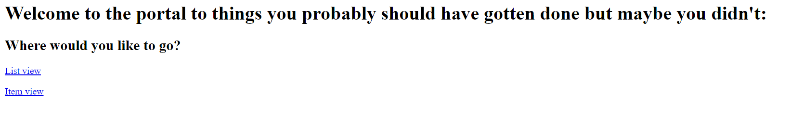
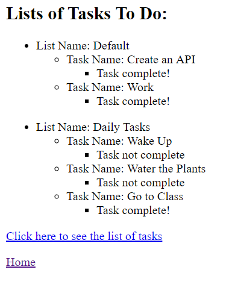
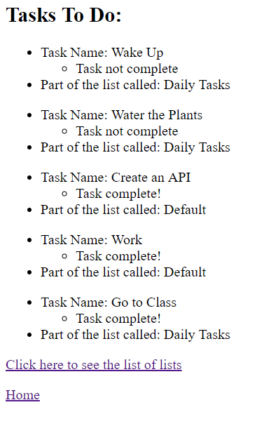

# Lab18UsingYourAPI

## Summary  
This website is used to consume a custom API.  
It is more of a concept verification than a site used for actual applications.  
For directions on how to use it, look below at the "Directions" part of this README.  

## Visuals
Here I will show images of the website:  
Here is the index page:  
  
Here is the list page:  
  
Here is the item page:  
  

## Directions
For using the website itself:  
1. Go to this site: [https://lab18usingyourapi.azurewebsites.net/](https://lab18usingyourapi.azurewebsites.net/)  
2. Click on either "List view" or "Item view" to see what is in the custom API.

For editing this solution:  
1. Download Visual Studio  
2. Clone this repository (Lab18UsingYourAPI)
3. Open the file: "Lab18UsingYourAPI.sln" with Visual Studio
4. Edit to your heart's content
5. To see changes that you did, open the "Debug" menu and press the "Start Without Debugging" option  

## Other Details
As stated at the start, this application is only a proof of concept:  
Firsty, that I am able to create and host my own API.  
Secondly, that I am able to consume this custom API.  